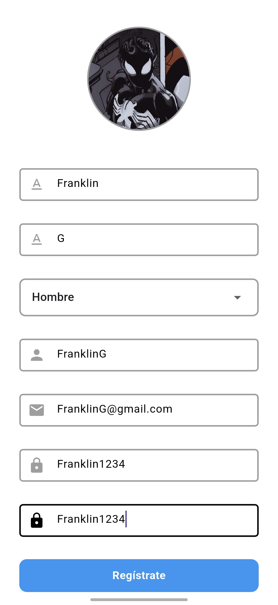

# **Proyecto intercilo - UPSGlam 2.0**

**Integrantes:**
* Henry Tacuri
* Franklin Guapisaca
* Juan Quizhpi

# **Arquitectura de la aplicación**

La arquitectura de la aplicación UPSGlam 2.0, representada en el diagrama, se basa en una estructura de microservicios distribuidos que se comunican entre sí mediante el protocolo HTTP. Este enfoque favorece la escalabilidad, la modularidad y la facilidad de mantenimiento del sistema. La solución se organiza en cuatro componentes principales: frontend móvil, backend reactivo, procesamiento de imágenes con GPU y servicios en la nube.

El frontend, desarrollado con Flutter, permite a los usuarios registrarse, iniciar sesión, subir imágenes, aplicar filtros y visualizar publicaciones en tiempo real. Este cliente móvil se comunica con un backend reactivo implementado con Spring WebFlux, estructurado en servicios que gestionan la autenticación, los usuarios, las fotos y el procesamiento de imágenes. Todo el backend realizado con spring boot está dockerizado.

El procesamiento de imágenes, está desarrollado con PyCUDA, incluye filtros personalizados como: Filtro Log, Filtro Media, Filtro Gaussiano, Filtro Cartoon, Filtro Sketch, Filtro Térmico y FiltroAsciiUps. Estos filtros se ejecutan de forma paralela sobre la GPU, optimizando el rendimiento y mejorando la experiencia del usuario. Por otra parte, todo este procesamiento de imágenes está dockerizado.

Con los contenedores backend y pycuda, se realiza la orquestación de contenedores para que puedan comunicarse entre sí. Finalmente, todos estos contenedores son levantados para que la aplicación móvil pueda consumir los respectivos servicios. La aplicación utiliza servicios en la nube de Firebase como Authentication, Firestore y Storage para gestionar la autenticación de usuarios, el almacenamiento de datos y la gestión de publicaciones.


# **Despliegue de la aplicación**

**1.** Para levantar los contenedores (Backend Spring Boot y PyCuda) se deberá crear el archivo ```docker-compose.yml```, el cual contendra el siguiente contenido:

```docker
version: '3.8'  # Versión de Docker Compose

services:
  python_app:
    image: henrytacuri/upsglam_pycuda:latest #Imagen de Docker Hub
    container_name: python_app   # Nombre personalizado para el contenedor (opcional pero útil)
    gpus: "all"                  # Asigna todas las GPUs disponibles al contenedor (requiere soporte NVIDIA)
    ports:
      - 5000:5000                # Mapea el puerto 5000 del host al 5000 del contenedor
    restart: unless-stopped      # Reinicia el contenedor a menos que haya sido detenido manualmente

  backend:
    image: henrytacuri/upsglam_backend:latest #Imagen de Docker Hub
    container_name: upsglam_backend # Nombre personalizado para el contenedor del backend
    ports:
      - 8080:8080                # Mapea el puerto 8080 del host al 8080 del contenedor
    restart: unless-stopped      # Reinicia el contenedor automáticamente salvo que se detenga manualmente
    depends_on:
      - python_app               # Este servicio depende de que python_app esté iniciado primero
```

Todos los Dockerfiles con los cuales se construyeron las imagenes de docker (ahora subidas a Docker Hub) están en las carpetas de los respectivos proyectos de Spring Boot y PyCuda.

**2.** Luego abrimos una terminal dentro del mismo directorio donde se creo el archivo ```docker-compose.yml``` y ejecutamos el comando ```docker compose up```.

**3.** En la terminal se vizualizará que los contenedores están ejecutandose correctamente.

**4.** Luego en el dispositivo android instalamos la aplicación móvil por medio del apk el cual tiene el nombre ```upsglam```.


# **Uso de la aplicación**

**1.** Creación de cuenta

Si no contamos con una cuenta creada damos click en el boton de Registrate y llenamos los campos



**2.** Login

**3.** Feed de publicaciones en orden cronológico

**4.** Procesamiento y publicación de fotos

**5.** Galería de fotos

**7.** Datos del usuario

### **Repositorios**

* **Frontend - Flutter (App móvil):** https://github.com/HenryTacuri/upsglam_frontend

* **Backend - Spring Boot:** https://github.com/HenryTacuri/upsglam_backend

* **PyCuda:** https://github.com/JuanQuizhpi/BackFiltrosFlask


**URL del apk de la aplicación móvil:** 
